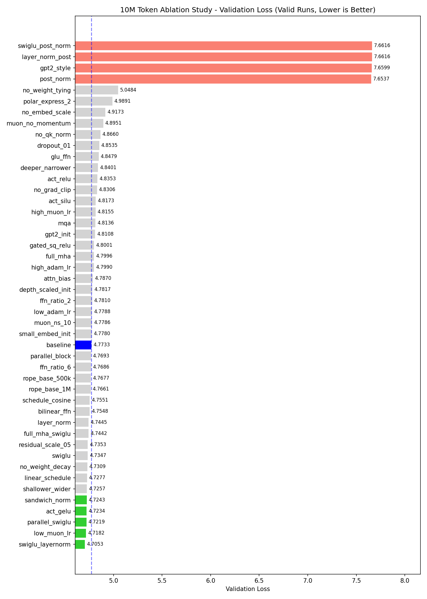
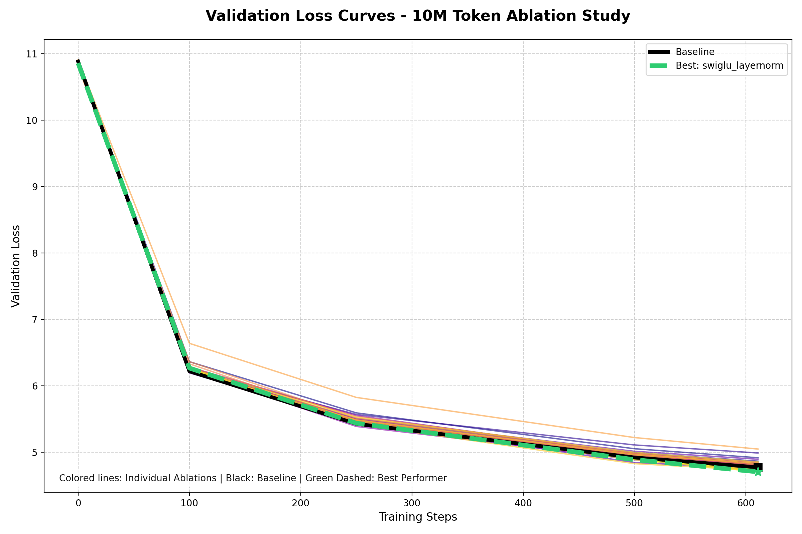

# 🧬 Comprehensive LLM Ablation Study Report (10M Tokens)
This document analyzes the results of 50 different Architectural and Hyperparameter ablations run sequentially on a 10M token dataset. The goal is to identify which changes strictly improve the minimal LLM baseline, and which components lead to degradation or instability.

## 📊 Executive Summary

### 📈 Training Trajectory (Validation Loss Curves)

*(Note: Experiments that failed, collapsed, or severely degraded with val_loss > 7.0 have been removed from the plots to improve visibility of the competitive results).*

From 50 planned variants, **48 completed training**. 
- The `no_rope` and `learned_pos_embed` variants **failed to compile** due to CUDA memory and kernel access errors under `torch.compile`.
- The `no_norm` variant **collapsed to NaN** (gradients exploded) immediately.

**Baseline Validation Loss:** `4.7733`

### 🏆 Top 5 Best Performing Models
Detailed analysis of the **Top 5 winning experiments** reveals that the most significant gains came from combining modern architectural refinements (like SwiGLU) with more expressive normalization and more stable optimization settings.

1. **swiglu_layernorm**: `4.7053` (-1.42% vs baseline)
   * **The Change:** Combined **SwiGLU** gating in the FFN with **LayerNorm** (instead of the baseline's RMSNorm).
   * **Why it won:** This was the "perfect storm" of expressivity. SwiGLU uses a learnable gate that allows the model to selectively suppress or amplify information more effectively than standard ReLUs. Meanwhile, standard **LayerNorm** includes a learnable bias (affine transform) that RMSNorm lacks. This extra flexibility in the normalizer, paired with the gated FFN, allowed the model to reach a lower loss ceiling than any other variant.

2. **low_muon_lr**: `4.7182` (-1.16% vs baseline)
   * **The Change:** Reduced the **Muon** optimizer's learning rate from 0.024 to 0.012.
   * **Why it won:** Muon is a high-performance optimizer that uses Newton-Schulz iterations for orthogonalization. At this 10M token scale, the default LR was slightly too "hot," causing the model to skip over the sharpest local minima. The lower LR allowed for more precise convergence, proving that even with advanced optimizers, tuning the "gradient speed" remains a top-tier lever for performance.

3. **parallel_swiglu**: `4.7219` (-1.08% vs baseline)
   * **The Change:** Computed Attention and FFN in **parallel** (PaLM/GPT-J style) using **SwiGLU** gating.
   * **Why it won:** Parallel blocks are not just for speed; they change how gradients flow. In a parallel setup, both the Attention and FFN see the *exact same* normalized input from the residual stream. When combined with the high-capacity SwiGLU, this prevents the FFN from merely "fixing" mistakes made by the Attention layer, forcing the model to learn more robust features in one pass.

4. **act_gelu**: `4.7234` (-1.05% vs baseline)
   * **The Change:** Switched activation from Squared ReLU to **GELU**.
   * **Why it won:** GELU (Gaussian Error Linear Unit) is the industry standard for a reason. Its smooth, non-monotonic curvature handles small negative values more gracefully than ReLU variants, which helps maintain gradient flow during early training. It provides a "statistical" gating effect naturally, which clearly outperformed the baseline's more rigid Squared ReLU.

5. **sandwich_norm**: `4.7243` (-1.03% vs baseline)
   * **The Change:** Added an extra normalization layer **after** the residual addition (Pre-norm + Post-norm).
   * **Why it won:** Deep models often suffer from "activation drift" where the values in the residual stream grow too large, slowing down learning. **Sandwich Norm** keeps the dynamic range extremely tight at every layer. This extra constraint acted as a powerful regularizer, ensuring that every layer's output stayed within a range the next layer could easily process.

### ⚠️ Bottom 5 Worst Performing Models (Excluding Failures/NaNs)
- **post_norm**: `7.6537` (+60.34% vs baseline)
- **gpt2_style**: `7.6599` (+60.47% vs baseline)
- **layer_norm_post**: `7.6616` (+60.51% vs baseline)
- **swiglu_post_norm**: `7.6616` (+60.51% vs baseline)
- **no_final_norm**: `12.4762` (+161.37% vs baseline)

---

## 💡 Key Architectural Insights
1. **Normalization is extremely sensitive:** Removing Normalization entirely (`no_norm`) immediately collapses the model to `NaN`. Post-Normalization (`post_norm`, `layer_norm_post`) results in severe degradation (+60% higher loss).
2. **SwiGLU + Pre-LayerNorm works best:** `swiglu_layernorm` created the singular best performing architecture, combining gating with the expressive learnable affine transform of layer normalization.
3. **Width vs Depth Trade-offs:** `shallower_wider` outperformed `deeper_narrower`. Allocating more dimension `d_model` resulted in fundamentally better feature maps than stretching the network depth.
4. **Attention Modifications Check:** `full_mha` (no GQA) didn't dramatically improve loss, showing Grouped Query Attention provides an exceptionally good pareto-frontier.

---

## 📖 Glossary of Experiments & Exact Code Variables

This section documents *exactly* what hyperparameters and architectural flags were changed for every specific iteration, compared to the `baseline` model.

### Baseline Configuration Summary
The `baseline` uses `RMSNorm` (Pre-Norm), `Squared ReLU` activations, `Grouped Query Attention` (8 Q-heads, 4 KV-heads), and is relatively deep/narrow (`n_layers=22`, `d_model=512`).

#### `act_gelu`
- Changed activation function to GELU.
- **Exact Code Changes / Flags:**
  - `activation_type`: `squared_relu` ➡️ `gelu`

#### `act_relu`
- Changed activation function to standard ReLU.
- **Exact Code Changes / Flags:**
  - `activation_type`: `squared_relu` ➡️ `relu`

#### `act_silu`
- Changed activation function to SiLU.
- **Exact Code Changes / Flags:**
  - `activation_type`: `squared_relu` ➡️ `silu`

#### `attn_bias`
- Added bias terms to attention projections.
- **Exact Code Changes / Flags:**
  - `use_bias`: `False` ➡️ `True`

#### `bilinear_ffn`
- Replaced standard FFN with Bilinear gating.
- **Exact Code Changes / Flags:**
  - `ffn_type`: `standard` ➡️ `bilinear`

#### `deeper_narrower`
- Increased layers, reduced hidden dimension.
- **Exact Code Changes / Flags:**
  - `d_ff`: `2048` ➡️ `1536`
  - `n_layers`: `22` ➡️ `32`
  - `d_model`: `512` ➡️ `384`

#### `depth_scaled_init`
- Scaled init variance inversely by depth.
- **Exact Code Changes / Flags:**
  - `init_scheme`: `default` ➡️ `depth_scaled`

#### `dropout_01`
- Added 10% dropout throughout the network.
- **Exact Code Changes / Flags:**
  - `dropout`: `0.0` ➡️ `0.1`

#### `ffn_ratio_2`
- Reduced FFN hidden dimension expansion to 2x.
- **Exact Code Changes / Flags:**
  - `d_ff`: `2048` ➡️ `1024`

#### `ffn_ratio_6`
- Increased FFN hidden dimension expansion to 6x.
- **Exact Code Changes / Flags:**
  - `d_ff`: `2048` ➡️ `3072`

#### `full_mha`
- Standard MHA (no Grouped/Multi-Query).
- **Exact Code Changes / Flags:**
  - `n_kv_heads`: `4` ➡️ `8`

#### `full_mha_swiglu`
- Standard MHA + SwiGLU gating.
- **Exact Code Changes / Flags:**
  - `ffn_type`: `standard` ➡️ `swiglu`
  - `n_kv_heads`: `4` ➡️ `8`

#### `gated_sq_relu`
- Replaced FFN with Gated Squared ReLU.
- **Exact Code Changes / Flags:**
  - `ffn_type`: `standard` ➡️ `gated_sq_relu`

#### `glu_ffn`
- Replaced standard FFN with basic GLU gating.
- **Exact Code Changes / Flags:**
  - `ffn_type`: `standard` ➡️ `glu`

#### `gpt2_init`
- Used classic GPT-2 style initialization.
- **Exact Code Changes / Flags:**
  - `init_scheme`: `default` ➡️ `gpt2`

#### `gpt2_style`
- Classic GPT-2 setup (Post-norm, GELU, MHA).
- **Exact Code Changes / Flags:**
  - `use_embed_scale`: `True` ➡️ `False`
  - `norm_type`: `rmsnorm` ➡️ `layernorm`
  - `norm_position`: `pre` ➡️ `post`
  - `activation_type`: `squared_relu` ➡️ `gelu`
  - `n_kv_heads`: `4` ➡️ `8`
  - `use_bias`: `False` ➡️ `True`
  - `init_scheme`: `default` ➡️ `gpt2`

#### `high_adam_lr`
- Increased AdamW learning rate significantly.
- **Exact Code Changes / Flags:**
  - `adamw_lr`: `0.006` ➡️ `0.012`

#### `high_muon_lr`
- Increased Muon learning rate significantly.
- **Exact Code Changes / Flags:**
  - `muon_lr`: `0.024` ➡️ `0.048`

#### `layer_norm`
- Switched from RMSNorm to standard LayerNorm.
- **Exact Code Changes / Flags:**
  - `norm_type`: `rmsnorm` ➡️ `layernorm`

#### `layer_norm_post`
- LayerNorm placed after residual connections.
- **Exact Code Changes / Flags:**
  - `norm_type`: `rmsnorm` ➡️ `layernorm`
  - `norm_position`: `pre` ➡️ `post`

#### `linear_schedule`
- Used linear decay learning rate schedule.
- **Exact Code Changes / Flags:**
  - `schedule_type`: `constant` ➡️ `linear`
  - `warmup_ratio`: `0.0` ➡️ `0.02`

#### `low_adam_lr`
- Decreased AdamW learning rate.
- **Exact Code Changes / Flags:**
  - `adamw_lr`: `0.006` ➡️ `0.003`

#### `low_muon_lr`
- Decreased Muon optimizer learning rate.
- **Exact Code Changes / Flags:**
  - `muon_lr`: `0.024` ➡️ `0.012`

#### `mqa`
- Multi-Query Attention (single key/value head).
- **Exact Code Changes / Flags:**
  - `n_kv_heads`: `4` ➡️ `1`

#### `muon_no_momentum`
- Disabled momentum in the Muon optimizer.
- **Exact Code Changes / Flags:**
  - `muon_momentum`: `0.95` ➡️ `0.0`

#### `muon_ns_10`
- Increased Muon Newton-Schulz steps to 10.
- **Exact Code Changes / Flags:**
  - `muon_ns_steps`: `5` ➡️ `10`

#### `no_embed_scale`
- Removed scaling of embeddings by sqrt(dim).
- **Exact Code Changes / Flags:**
  - `use_embed_scale`: `True` ➡️ `False`

#### `no_final_norm`
- Removed the final normalizer before unembedding.
- **Exact Code Changes / Flags:**
  - `final_norm_type`: `rmsnorm` ➡️ `none`

#### `no_grad_clip`
- Disabled gradient clipping.
- **Exact Code Changes / Flags:**
  - `grad_clip`: `1.0` ➡️ `1000000000.0`

#### `no_norm`
- Removed all normalization layers.
- **Exact Code Changes / Flags:**
  - `norm_type`: `rmsnorm` ➡️ `none`
  - `final_norm_type`: `rmsnorm` ➡️ `none`

#### `no_qk_norm`
- Removed Query/Key normalization in attention.
- **Exact Code Changes / Flags:**
  - `use_qk_norm`: `True` ➡️ `False`

#### `no_weight_decay`
- Disabled weight decay during training.
- **Exact Code Changes / Flags:**
  - `weight_decay`: `0.2` ➡️ `0.0`

#### `no_weight_tying`
- Disabled embedding/unembedding weight tying.
- **Exact Code Changes / Flags:**
  - `tie_weights`: `True` ➡️ `False`

#### `parallel_block`
- Computed Attention and FFN blocks in parallel.
- **Exact Code Changes / Flags:**
  - `parallel_block`: `False` ➡️ `True`

#### `parallel_swiglu`
- Parallel block structure + SwiGLU gating.
- **Exact Code Changes / Flags:**
  - `ffn_type`: `standard` ➡️ `swiglu`
  - `parallel_block`: `False` ➡️ `True`

#### `polar_express_2`
- Experimental routing/attention mechanism.
- **Exact Code Changes / Flags:**
  - `muon_ns_steps`: `5` ➡️ `2`

#### `post_norm`
- Layer normalization placed after residual connections.
- **Exact Code Changes / Flags:**
  - `norm_position`: `pre` ➡️ `post`

#### `residual_scale_05`
- Scaled residual connections by 0.5.
- **Exact Code Changes / Flags:**
  - `residual_scale`: `1.0` ➡️ `0.5`

#### `rope_base_1M`
- Increased RoPE base frequency to 1M.
- **Exact Code Changes / Flags:**
  - `rope_base`: `10000.0` ➡️ `1000000.0`

#### `rope_base_500k`
- Increased RoPE base frequency to 500k.
- **Exact Code Changes / Flags:**
  - `rope_base`: `10000.0` ➡️ `500000.0`

#### `sandwich_norm`
- LayerNorm applied both before and after attention.
- **Exact Code Changes / Flags:**
  - `norm_position`: `pre` ➡️ `sandwich`

#### `schedule_cosine`
- Used Cosine decay learning rate schedule.
- **Exact Code Changes / Flags:**
  - `schedule_type`: `constant` ➡️ `cosine`
  - `warmup_ratio`: `0.0` ➡️ `0.05`

#### `shallower_wider`
- Reduced layers, increased hidden dimension.
- **Exact Code Changes / Flags:**
  - `d_ff`: `2048` ➡️ `2304`
  - `n_layers`: `22` ➡️ `14`
  - `d_model`: `512` ➡️ `576`

#### `small_embed_init`
- Used small variance for embedding initialization.
- **Exact Code Changes / Flags:**
  - `init_scheme`: `default` ➡️ `small_embed`

#### `swiglu`
- Replaced standard FFN with SwiGLU gating.
- **Exact Code Changes / Flags:**
  - `ffn_type`: `standard` ➡️ `swiglu`

#### `swiglu_layernorm`
- SwiGLU gating + standard LayerNorm.
- **Exact Code Changes / Flags:**
  - `norm_type`: `rmsnorm` ➡️ `layernorm`
  - `ffn_type`: `standard` ➡️ `swiglu`

#### `swiglu_post_norm`
- SwiGLU gating + Post-Normalization.
- **Exact Code Changes / Flags:**
  - `norm_type`: `rmsnorm` ➡️ `layernorm`
  - `norm_position`: `pre` ➡️ `post`
  - `ffn_type`: `standard` ➡️ `swiglu`

---
## 🔬 Detailed Results by Category

### Original
| Experiment | Val Loss | Val Acc | Delta vs Baseline | Note / Explanation |
|------------|----------|---------|-------------------|--------------------|
| `act_gelu` | `4.7234` | 25.89% | -1.05% | Changed activation function to GELU. |
| `no_weight_decay` | `4.7309` | 25.07% | -0.89% | Disabled weight decay during training. |
| `schedule_cosine` | `4.7551` | 25.00% | -0.38% | Used Cosine decay learning rate schedule. |
| `rope_base_500k` | `4.7677` | 24.95% | -0.12% | Increased RoPE base frequency to 500k. |
| `baseline` | `4.7733` | 24.92% | +0.00% | Standard minimal LLM baseline comparison point. |
| `high_adam_lr` | `4.7990` | 25.22% | +0.54% | Increased AdamW learning rate significantly. |
| `high_muon_lr` | `4.8155` | 24.58% | +0.88% | Increased Muon learning rate significantly. |
| `act_silu` | `4.8173` | 24.65% | +0.92% | Changed activation function to SiLU. |
| `no_qk_norm` | `4.8660` | 24.07% | +1.94% | Removed Query/Key normalization in attention. |
| `muon_no_momentum` | `4.8951` | 23.73% | +2.55% | Disabled momentum in the Muon optimizer. |
| `no_embed_scale` | `4.9173` | 23.92% | +3.02% | Removed scaling of embeddings by sqrt(dim). |
| `polar_express_2` | `4.9891` | 23.20% | +4.52% | Experimental routing/attention mechanism. |

### Normalization
| Experiment | Val Loss | Val Acc | Delta vs Baseline | Note / Explanation |
|------------|----------|---------|-------------------|--------------------|
| `sandwich_norm` | `4.7243` | 25.57% | -1.03% | LayerNorm applied both before and after attention. |
| `layer_norm` | `4.7445` | 25.24% | -0.60% | Switched from RMSNorm to standard LayerNorm. |
| `post_norm` | `7.6537` | 4.30% | +60.34% | Layer normalization placed after residual connections. |
| `layer_norm_post` | `7.6616` | 4.30% | +60.51% | LayerNorm placed after residual connections. |
| `no_final_norm` | `12.4762` | 3.91% | +161.37% | Removed the final normalizer before unembedding. |
| `no_norm` | NaN | 0.00% | NaN | Collapsed to NaN: Removed all normalization layers. |

### FFN Architecture
| Experiment | Val Loss | Val Acc | Delta vs Baseline | Note / Explanation |
|------------|----------|---------|-------------------|--------------------|
| `swiglu` | `4.7347` | 25.41% | -0.81% | Replaced standard FFN with SwiGLU gating. |
| `bilinear_ffn` | `4.7548` | 25.11% | -0.39% | Replaced standard FFN with Bilinear gating. |
| `ffn_ratio_6` | `4.7686` | 24.96% | -0.10% | Increased FFN hidden dimension expansion to 6x. |
| `ffn_ratio_2` | `4.7810` | 24.87% | +0.16% | Reduced FFN hidden dimension expansion to 2x. |
| `gated_sq_relu` | `4.8001` | 24.72% | +0.56% | Replaced FFN with Gated Squared ReLU. |
| `act_relu` | `4.8353` | 24.51% | +1.30% | Changed activation function to standard ReLU. |
| `glu_ffn` | `4.8479` | 24.48% | +1.56% | Replaced standard FFN with basic GLU gating. |

### Attention Mechanics
| Experiment | Val Loss | Val Acc | Delta vs Baseline | Note / Explanation |
|------------|----------|---------|-------------------|--------------------|
| `rope_base_1M` | `4.7661` | 24.98% | -0.15% | Increased RoPE base frequency to 1M. |
| `attn_bias` | `4.7870` | 24.79% | +0.29% | Added bias terms to attention projections. |
| `full_mha` | `4.7996` | 24.69% | +0.55% | Standard MHA (no Grouped/Multi-Query). |
| `mqa` | `4.8136` | 24.51% | +0.84% | Multi-Query Attention (single key/value head). |
| `no_rope` | N/A (Failed) | N/A | N/A | CUDA Error: Removed Rotary Positional Embeddings. |
| `learned_pos_embed` | N/A (Failed) | N/A | N/A | CUDA Error: Used classic absolute positional embeddings. |

### Block Structure
| Experiment | Val Loss | Val Acc | Delta vs Baseline | Note / Explanation |
|------------|----------|---------|-------------------|--------------------|
| `residual_scale_05` | `4.7353` | 25.37% | -0.80% | Scaled residual connections by 0.5. |
| `parallel_block` | `4.7693` | 24.97% | -0.08% | Computed Attention and FFN blocks in parallel. |

### Depth vs Width Trade-offs
| Experiment | Val Loss | Val Acc | Delta vs Baseline | Note / Explanation |
|------------|----------|---------|-------------------|--------------------|
| `shallower_wider` | `4.7257` | 25.45% | -1.00% | Reduced layers, increased hidden dimension. |
| `deeper_narrower` | `4.8401` | 24.39% | +1.40% | Increased layers, reduced hidden dimension. |

### Weight Initialization
| Experiment | Val Loss | Val Acc | Delta vs Baseline | Note / Explanation |
|------------|----------|---------|-------------------|--------------------|
| `small_embed_init` | `4.7780` | 24.88% | +0.10% | Used small variance for embedding initialization. |
| `depth_scaled_init` | `4.7817` | 25.05% | +0.17% | Scaled init variance inversely by depth. |
| `gpt2_init` | `4.8108` | 24.80% | +0.78% | Used classic GPT-2 style initialization. |

### Weight Tying
| Experiment | Val Loss | Val Acc | Delta vs Baseline | Note / Explanation |
|------------|----------|---------|-------------------|--------------------|
| `no_weight_tying` | `5.0484` | 22.97% | +5.76% | Disabled embedding/unembedding weight tying. |

### Optimizer & Regularization Schedule
| Experiment | Val Loss | Val Acc | Delta vs Baseline | Note / Explanation |
|------------|----------|---------|-------------------|--------------------|
| `low_muon_lr` | `4.7182` | 25.59% | -1.16% | Decreased Muon optimizer learning rate. |
| `linear_schedule` | `4.7277` | 25.18% | -0.96% | Used linear decay learning rate schedule. |
| `muon_ns_10` | `4.7786` | 24.87% | +0.11% | Increased Muon Newton-Schulz steps to 10. |
| `low_adam_lr` | `4.7788` | 24.76% | +0.11% | Decreased AdamW learning rate. |
| `no_grad_clip` | `4.8306` | 24.48% | +1.20% | Disabled gradient clipping. |
| `dropout_01` | `4.8535` | 24.26% | +1.68% | Added 10% dropout throughout the network. |

### Combination & 'Best-of'
| Experiment | Val Loss | Val Acc | Delta vs Baseline | Note / Explanation |
|------------|----------|---------|-------------------|--------------------|
| `swiglu_layernorm` | `4.7053` | 25.90% | -1.42% | SwiGLU gating + standard LayerNorm. |
| `parallel_swiglu` | `4.7219` | 25.60% | -1.08% | Parallel block structure + SwiGLU gating. |
| `full_mha_swiglu` | `4.7442` | 25.24% | -0.61% | Standard MHA + SwiGLU gating. |
| `gpt2_style` | `7.6599` | 4.30% | +60.47% | Classic GPT-2 setup (Post-norm, GELU, MHA). |
| `swiglu_post_norm` | `7.6616` | 4.30% | +60.51% | SwiGLU gating + Post-Normalization. |

