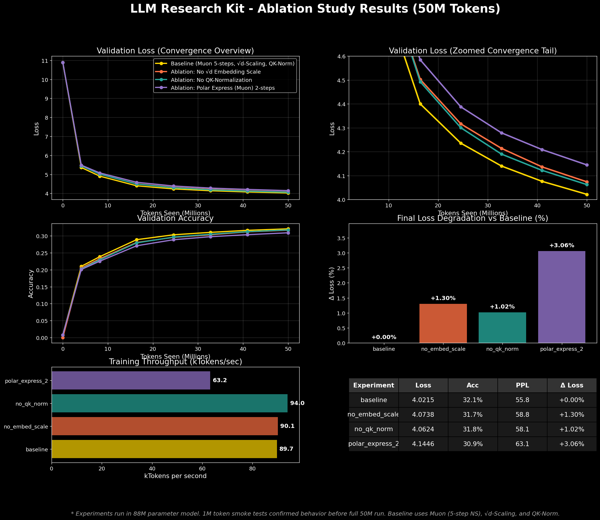

# 88M LLM Ablation Study: 50M Tokens (Detailed Report)

## 📌 Executive Summary
Across **200M total tokens** (50M per experiment), we identified three critical insights into model stability and convergence:

*   **Muon Orthogonalization Fidelity (+3.06% loss)**: Reducing Polar Express iterations from 5 to 2 severely degraded gradient quality, proving precise orthogonalization is vital for deep training and worth the computational cost.
*   **Embedding Scaling ($\sqrt{d_{model}}$) (+1.30% loss)**: Without this scaling, the model starts with random accuracy ($1/V$) and stumbles initially. Baseline scaling ($\times 22.6$) enforces a variance of ~1.0, enabling stable, immediate feature learning.
*   **QK-Normalization (+1.02% loss)**: Bounding attention logits with RMSNorm provides a smoother optimization landscape and consistent sample efficiency gains, demonstrating its value even at smaller scales (<100M parameters).

## 1. Experimental Setup
To ensure strict fairness, all models were trained from scratch with an identical random seed (`42`), memory footprint, and data shuffling sequence.

*   **Architecture**: 88M dense transformer (22 layers, `d_model` = 512, `n_heads` = 8, GQA 4 KV heads).
*   **Dataset**: `vukrosic/blueberry-1B-pretrain` (50M tokens).
*   **Optimization**: Hybrid Muon (63.4M 2D params, LR 0.024) + AdamW (25.1M 1D params, LR 0.006).
*   **Training Loop**: Batch size 4, sequence length 2048. Trained for 6,104 steps using `torch.compile` and bfloat16.

## 2. Baseline vs Ablations
The **baseline** architecture integrates a 5-step Muon optimizer, $\sqrt{d_{model}}$ embedding scaling, and QK-Norm. We ablated each to measure relative impact:

| Experiment | Final Val Loss | Δ vs Baseline | Insight |
| :--- | :--- | :--- | :--- |
| **Baseline** | **4.0215** | — | — |
| No-QK-Norm | 4.0624 | +1.02% | Entropy collapse prevention and gradient cleanliness remain highly relevant at smaller scales. |
| No-Embed-Scale | 4.0738 | +1.30% | Absolutely necessary to avoid uniform starting distributions and poor initialization dynamics. |
| Polar-Express-2 | 4.1446 | +3.06% | High-fidelity orthogonalization (5 steps) is non-negotiable for Muon's overall effectiveness. |

## 3. Conclusion
The current `llm-research-kit` baseline configuration is solidly justifiable. The Muon optimizer strictly requires its full 5-step iterative approximation to function correctly, while the specific architectural decisions—embedding variance scaling and QK-norm—demonstrate outsized positive impacts on early learning dynamics.
