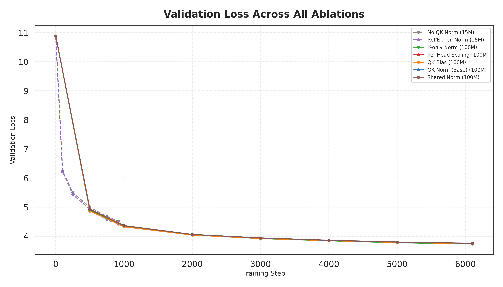
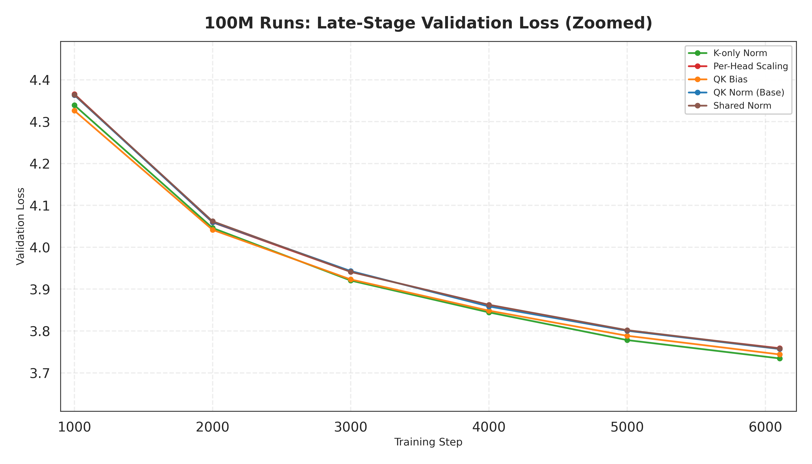
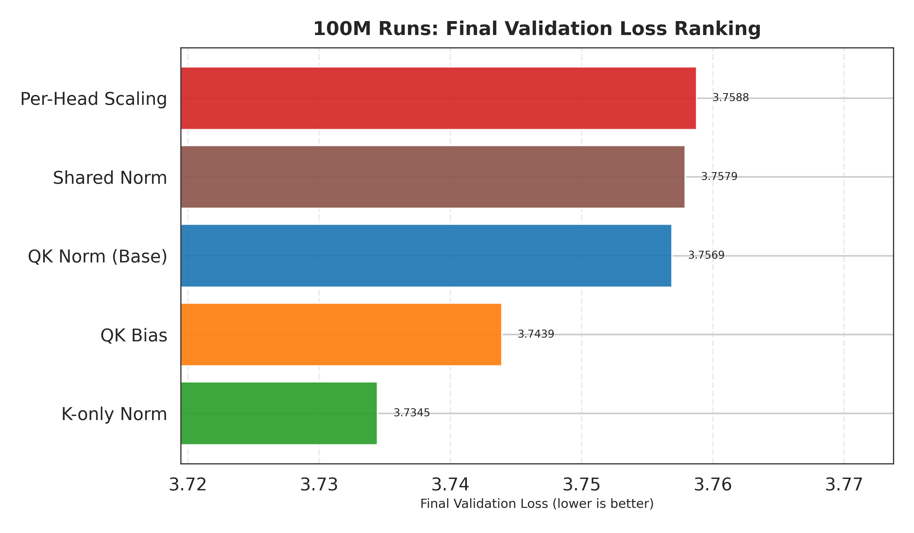
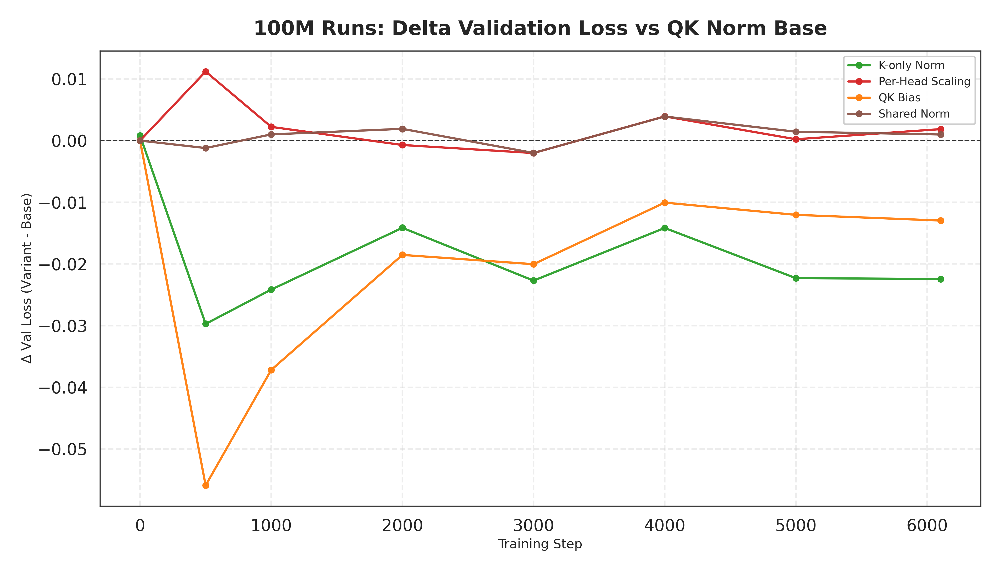
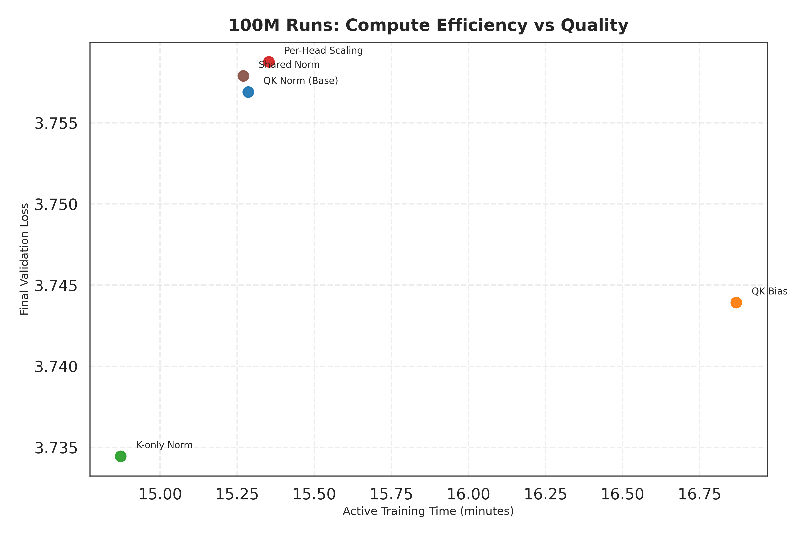
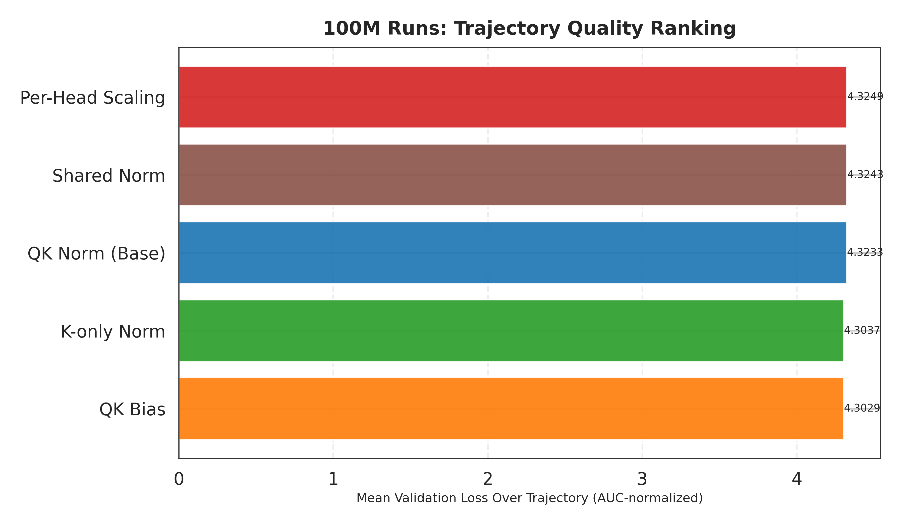
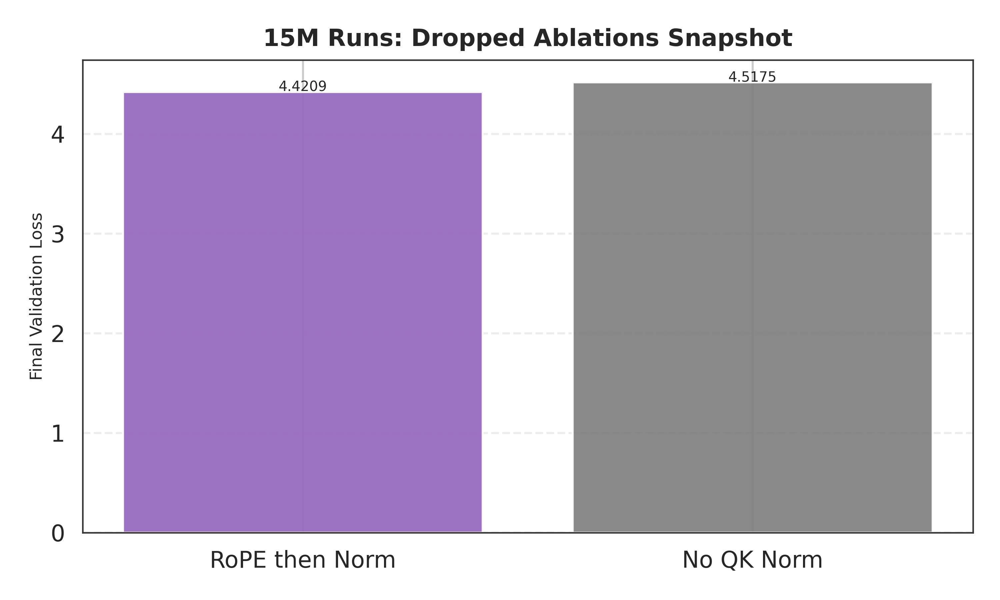

# QK Normalization Ablations at 100M Tokens

## Abstract
We evaluate QK-normalization variants in a controlled decoder-only Transformer setup trained on the same dataset, seed (`42`), and optimizer settings. QK normalization here refers to applying an RMS normalization over the per-head query/key vectors used to form attention logits, with RoPE positional rotation applied either before or after normalization depending on the variant. The primary comparison uses 100M-token runs (`6104` optimizer steps; `100,007,936` tokens seen), with two short 15M-token sanity runs (`916` steps; `15,007,744` tokens) for failure-mode checks. Validation is milestone-based and uses a fixed slice of the validation loader (`eval_steps=100` batches), so comparisons are consistent but absolute values have some sampling noise.

At 100M tokens, **K-only normalization** achieves the best final validation loss (`3.7345`), improving over the base QK-norm configuration by `-0.0224` loss points (`-0.60%`). **QK bias** is second-best in final loss (`3.7439`) and best in trajectory-averaged loss (AUC-normalized), but with higher active training time. Shared norm and per-head scaling are nearly tied with base and do not improve final quality at this scale.

## 1. Setup

### 1.1 Model and data
- Architecture: decoder-only Transformer (~`88.6M` trainable parameters; tied input/output embeddings) with pre-norm RMSNorm blocks and Grouped-Query Attention (GQA): (`d_model=512`, `n_layers=22`, `n_heads=8`, `n_kv_heads=4`, `d_ff=2048`, `d_k=64`, `max_seq_len=2048`, `vocab_size=49152`).
- Attention implementation: PyTorch `scaled_dot_product_attention` with `is_causal=True` (softmax is applied over keys per head; no explicit attention mask is used for training).
- Position encoding: RoPE with base `10000` applied to Q and K in `[B, T, H, d_k]` format before attention.
- MLP: bias-free `Linear(d_model→d_ff)` + squared-ReLU activation + `Linear(d_ff→d_model)` (Primer-style); dropout `0.0`.
- Tokenizer: `HuggingFaceTB/SmolLM2-135M`.
- Dataset path: `./processed_data/pretrain_1B` (pre-tokenized and chunked into fixed-length sequences of `max_seq_len=2048`; each example stores `input_ids` and `labels=input_ids`).
- Split size observed in logs: `439,453` train sequences, `48,829` val sequences.

### 1.2 Optimization and schedule
- Batch size: `8`, grad accumulation: `1`.
- Seed: `42` for all runs.
- Tokens per step: `batch_size * max_seq_len * grad_accum = 8 * 2048 * 1 = 16384` tokens. This implies `ceil(100,000,000 / 16384) = 6104` steps for the 100M-token runs and `ceil(15,000,000 / 16384) = 916` steps for the 15M-token runs.
- Optimizers: Muon + AdamW (`muon_lr=0.024`, `adamw_lr=0.006`, momentum `0.95`). Muon is applied to 2D weight matrices excluding embeddings and RMSNorm scales; the remaining parameters use AdamW.
- Schedule: constant LR, no warmup (`warmup_ratio=0.0`).
- Regularization: weight decay `0.2`, dropout `0.0`, grad clip `1.0`.
- Precision: AMP enabled.
- Compilation: `torch.compile` enabled with a short kernel warmup, then weights are reset to their initial state before timed training.
- Validation cadence: milestone evaluation (100M: steps `{0, 500, 1000, 2000, 3000, 4000, 5000}` plus a final evaluation at the end of training; 15M: steps `{0, 100, 250, 500, 750}` plus final). Each evaluation uses the first `eval_steps=100` batches from the validation loader.

### 1.3 Ablations
- `qk_norm` (base): apply RMSNorm to Q and K independently (separate norm parameters), then apply RoPE.
- `k_only_norm`: apply RMSNorm to K only (Q is left unnormalized), then apply RoPE.
- `qk_bias`: same as base QK norm, but add a learnable per-head bias after normalization and before RoPE (`b_q∈R^{n_heads×d_k}`, `b_k∈R^{n_kv_heads×d_k}`).
- `shared_norm`: use a single RMSNorm module (shared parameters) for both Q and K, then apply RoPE.
- `per_head_scaling`: learn a per-head scalar scale `s_h` applied multiplicatively to the query stream before attention (equivalently a learnable head-specific attention temperature); this variant is applied on top of base QK norm.
- `no_qk_norm` and `rope_then_norm`: short 15M-token baselines for failure-mode checks. `no_qk_norm` disables Q/K normalization entirely; `rope_then_norm` applies RoPE first, then RMSNorm (which is not equivalent to pre-RoPE normalization when RMSNorm has per-dimension scaling).

### 1.4 Metrics and reporting
- **Validation loss**: token-average cross-entropy for next-token prediction (causal LM shifting by one position). In evaluation we compute CE over `eval_steps=100` validation batches.
- **Validation accuracy**: next-token argmax accuracy over the same shifted targets.
- **Perplexity (PPL)**: `exp(min(val_loss, 20))` (loss clamped at `20` before exponentiation for numeric stability in logs).
- **Active training time**: time measured from the start of the timed training loop through the final evaluation, excluding setup/compilation warmup. (This includes the milestone validation passes.)
- **AUC-normalized trajectory loss**: average validation loss over training, approximated from the milestone curve via a trapezoidal rule and normalized by the step span:
  $$
  \mathrm{AUC}_{\text{norm}}=\frac{1}{s_N-s_0}\sum_{i=0}^{N-1}\frac{(L_i+L_{i+1})}{2}(s_{i+1}-s_i).
  $$

## 2. Mathematical framing

Standard attention logits per head are:

$$
z_{ij}^{(h)}=\frac{q_i^{(h)}\cdot k_j^{(h)}}{\sqrt{d_k}}, \quad
\alpha_{ij}^{(h)}=\mathrm{softmax}_j(z_{ij}^{(h)}).
$$

RMSNorm on a vector \(x\in\mathbb{R}^{d_k}\):

$$
\mathrm{RMSNorm}(x)=\gamma\odot \frac{x}{\sqrt{\frac{1}{d_k}\sum_{m=1}^{d_k}x_m^2+\epsilon}}.
$$

A generic normalized-QK formulation used by the variants:

$$
\tilde{q}_i^{(h)}=R_{\theta_i}\big(N_q(q_i^{(h)})+b_q^{(h)}\big), \quad
\tilde{k}_j^{(h)}=R_{\theta_j}\big(N_k(k_j^{(h)})+b_k^{(h)}\big),
$$
$$
z_{ij}^{(h)}=\alpha_h\frac{\tilde{q}_i^{(h)}\cdot\tilde{k}_j^{(h)}}{\sqrt{d_k}},
$$

where:
- \(N_q, N_k\) are either RMSNorm or identity (K-only sets \(N_q=I\)).
- \(b_q, b_k\) are zero unless using QK bias.
- \(\alpha_h=1\) except in per-head scaling.
- \(R_{\theta}\) is RoPE.

### Variant definitions (by operator order)
Using the notation above, the ablations correspond to the following choices:
- **Base QK norm**: \(N_q=\mathrm{RMSNorm}_{q}\), \(N_k=\mathrm{RMSNorm}_{k}\), \(b_q=b_k=0\), \(\alpha_h=1\), and RoPE is applied after normalization.
- **K-only norm**: \(N_q=I\), \(N_k=\mathrm{RMSNorm}_{k}\), with RoPE applied after the (key-only) normalization.
- **Shared norm**: \(N_q=N_k=\mathrm{RMSNorm}_{\text{shared}}\) (shared parameters), RoPE after normalization.
- **QK bias**: same as base QK norm but \(b_q^{(h)}\) and \(b_k^{(h)}\) are learned; biases are added *before* RoPE.
- **Per-head scaling**: same as base QK norm but with a learned scalar \(\alpha_h=s_h\) per head; implemented as scaling Q before the dot product.
- **RoPE then norm**: apply RoPE first, then \(N_q\) and \(N_k\) (with the same norm choices as base unless otherwise stated).

### Why normalization helps
If unnormalized components are approximately independent with variances \(\sigma_q^2,\sigma_k^2\), then:

$$
\mathrm{Var}(q\cdot k)\approx d_k \sigma_q^2\sigma_k^2.
$$

So logit scale can drift as activation norms change over training, causing overly sharp softmax (low-entropy attention) or overly flat softmax (under-confident attention). QK normalization reduces one source of variability by enforcing a stable RMS on per-head Q/K vectors before dot products. Concretely, if RMSNorm enforces \(\frac{1}{d_k}\sum_m \tilde{q}_m^2 \approx 1\) and similarly for \(\tilde{k}\), then \(\tilde{q}\cdot\tilde{k}\) has a more stable scale across steps, and the usual \(\frac{1}{\sqrt{d_k}}\) factor yields logits with approximately step-invariant magnitude. Per-head scaling can be viewed as re-introducing a controlled, learnable temperature \(\alpha_h\) once the baseline logit scale has been stabilized.

## 3. Results

All 100M variants are trained with identical token budgets and optimizer settings, so differences are attributable to the attention modification itself (within the noise of single-seed training). The absolute loss gaps are small (on the order of `1e-2`), but they are consistent across late-stage milestones and visible in the zoomed trajectory plots.

### 3.1 Main trajectories



Figure 1 overlays all available runs. Solid lines are 100M-token runs; dashed lines are 15M-token runs. Each marker corresponds to an evaluation milestone (plus the final evaluation at the end of training), not every training step.



Figure 2 zooms into late training (`step >= 1000`) to expose small but consistent differences. In this regime the best-performing configurations separate by only a few hundredths of a loss point, so a zoomed view is necessary to see the ordering.

### 3.2 Final metrics at 100M tokens



| Variant | Final Val Loss | Delta vs QK-Norm Base | Final PPL | Final Val Acc | Active Train Time (min) |
|---|---:|---:|---:|---:|---:|
| K-only Norm | 3.7345 | -0.0224 (-0.60%) | 41.865 | 0.3478 | 14.87 |
| QK Bias | 3.7439 | -0.0130 (-0.35%) | 42.264 | 0.3465 | 16.87 |
| QK Norm (Base) | 3.7569 | 0.0000 (0.00%) | 42.815 | 0.3455 | 15.29 |
| Shared Norm | 3.7579 | +0.0010 (+0.03%) | 42.858 | 0.3447 | 15.27 |
| Per-Head Scaling | 3.7588 | +0.0019 (+0.05%) | 42.895 | 0.3453 | 15.35 |

On final loss, K-only yields the largest improvement over the baseline (`-0.0224`, `-0.60%`) and is slightly faster (`-2.70%` active time vs base). QK bias improves final loss modestly (`-0.35%`) and is best by the trajectory metric, but is ~`10.36%` slower in active time in this run. Shared norm and per-head scaling are effectively tied with the baseline at this scale.

### 3.3 Relative dynamics and efficiency



Figure 4 shows loss differences relative to QK-norm base. QK bias is best through step `2000`, then K-only becomes best from step `3000` onward. Shared norm and per-head scaling track the baseline closely throughout (deltas near zero).



Figure 5 shows a quality/time tradeoff. QK bias improves loss but takes ~`10.36%` more active training time than base. K-only is both faster (`-2.70%`) and better.



Figure 6 ranks mean trajectory loss (AUC-normalized). QK bias is best by this metric (`4.3029`), with K-only nearly tied (`4.3037`), consistent with QK bias’s stronger early-phase behavior.

### 3.4 Short-run (15M) dropped ablations



At 15M tokens, `rope_then_norm` (4.4209) is better than `no_qk_norm` (4.5175), but both are materially worse than the 100M family and are not competitive long-run candidates from these results alone. These short runs are best interpreted as sanity checks for obvious failure modes (e.g., unstable attention/logit scale), not as reliable predictors of the 100M ordering.

## 4. Interpretation

- **Best final quality at 100M**: K-only normalization.
- **Best early trajectory / AUC**: QK bias.
- **No gain at this scale**: per-head scaling and shared norm.
- **Cross-over pattern**: QK bias leads earlier; K-only leads later.

This supports a useful split:
- If the budget is fixed on final quality, K-only is the strongest current setting.
- If earlier quality per step matters (e.g., short-horizon selection), QK bias is attractive despite higher compute.

One plausible explanation for the cross-over is that **QK bias adds early-phase flexibility**: after normalization stabilizes logit scale, a learned additive shift can help heads discover useful default behaviors (anchors/sinks) faster. In contrast, **K-only normalization preserves query magnitude**, which may retain a useful notion of “urgency” while still preventing large-norm keys from globally dominating attention. This asymmetry can plausibly help later-stage refinement without sacrificing stability.

Per-head scaling is theoretically motivated (heads learn different effective temperatures), but at this budget it does not beat the baseline. This may indicate that (i) the model already has sufficient implicit temperature control via learned projections and RMS scaling, (ii) a single scalar per head is too weak a knob relative to the other degrees of freedom, or (iii) the benefit only emerges at longer horizons / larger models.

## 5. Limitations

- Single run per variant (no multi-seed confidence intervals).
- Uneven token budgets across all experiments (100M main set, 15M short set).
- Results are specific to this architecture, optimizer stack, and dataset shard.
- Evaluation uses a fixed number of validation batches (`eval_steps=100`) rather than a full-pass validation epoch, so absolute loss values have some sampling noise (though comparisons are still meaningful under identical evaluation procedure).
- Training-time comparisons are based on the measured active training loop and can vary slightly due to runtime effects (kernel caching, evaluation overhead, and system load).

## 6. Reproducibility

1) Prepare the dataset directory referenced in the config (see `README.md`), e.g. `./processed_data/pretrain_1B`.

2) Run the 100M ablations (produces `checkpoints/*/metrics.json`, and also timestamped `plots/metrics_*` snapshots):

```bash
bash run_ablations.sh
```

3) (Optional) Re-run the 15M sanity checks by training with `train_tokens=15000000` and setting either `use_qk_norm=False` (`no_qk_norm`) or `qk_norm_after_rope=True` (`rope_then_norm`) in the config.

4) Generate all paper figures and the summary table from `checkpoints/*/metrics.json`:

```bash
python generate_paper_plots.py
```

Primary artifact table source:
- `plots/paper_results_summary.csv`

Run identifiers for the results reported in this draft (raw metric snapshots under `plots/`):

| Variant | Metrics snapshot |
|---|---|
| QK Norm (Base) | `plots/metrics_100000000_20260226_145000.json` |
| Per-Head Scaling | `plots/metrics_100000000_20260226_150536.json` |
| K-only Norm | `plots/metrics_100000000_20260226_152043.json` |
| Shared Norm | `plots/metrics_100000000_20260226_153614.json` |
| QK Bias | `plots/metrics_100000000_20260226_155341.json` |
| No QK Norm (15M) | `plots/metrics_15000000_20260226_140652.json` |
| RoPE then Norm (15M) | `plots/metrics_15000000_20260226_141109.json` |
