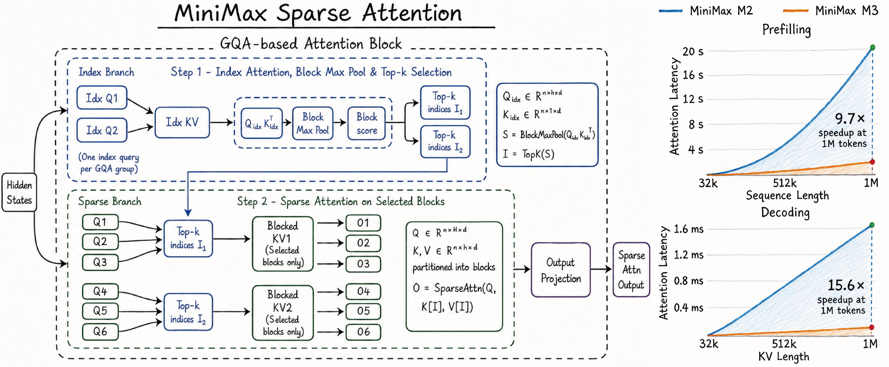

# MiniMax Sparse Attention Research

This repository is an open-source research lab for MiniMax-style sparse attention.

The goal is not to claim a finished model. The goal is to make the attention mechanism inspectable, testable, and ablatable:

- Does the implementation match the reference mechanism?
- Does the router select the blocks dense attention would use?
- Does sparse routing help as context length grows?
- Which architecture choices matter: `top_k`, `block_size`, `index_dim`, pooling, local fallback, or reuse?

- `models/`, `configs/`, `experiments/`, and `tests/` contain the sparse attention implementation.
- The dense/GQA baseline lives in the separate `vukrosic/llm-research-kit` repository and is used for comparison when needed.
- The current paper PDF lives at [`sparse_attention_short_paper.pdf`](./sparse_attention_short_paper.pdf).

Reference image source: https://x.com/SkylerMiao7/status/2059285750458544561



The sparse block implements the two-stage structure from the image:

1. **Index branch**: one index query per GQA group scores index keys, applies causal block max pooling, then chooses top-k KV blocks.
2. **Sparse branch**: normal Q heads attend only to the selected KV blocks for their GQA group, with token-level causal masking inside each block.

This is a clear PyTorch research implementation, not a fused inference kernel. It is meant to make architecture changes and experiment design easy before optimizing.

## Experiments

The repo is set up around a small set of repeatable experiments:

- **Correctness smoke**: `python -m unittest discover -s tests` checks shapes, gradients, causality, and LLM integration.
- **Router sanity**: `python experiments/block_retrieval_probe.py` tests whether the block router can recover a planted match before training.
- **Latency and sparsity sweep**: `python experiments/minimax_topk_sweep.py --seq_lens 128 256 512 --device auto` measures how `top_k` and `block_size` affect speed and sparsity.
- **Dense vs sparse training compare**: `python experiments/train_tiny_real_compare.py` trains the dense baseline and sparse model on the same real 40M-token slice so we can compare loss and throughput directly.
- **Long-context retrieval**: `python experiments/attention_diagnostics.py` and the retrieval-style probes check whether sparse routing still keeps the right blocks as context grows.
- **Architecture ablations**: the study scripts sweep `top_k`, `block_size`, pooling (`max`/`mean`/`log-sum-exp`), shared vs separate router projections, local fallback windows, and cross-layer reuse.

## Contributor Tasks

Good contributions are small, checkable research steps:

- audit masking, GQA grouping, block pooling, and sparse gather correctness;
- add dense-oracle selected-block recall diagnostics;
- build long-context retrieval tasks where routing quality matters;
- test local-plus-routed hybrid attention;
- expand the router ablation matrix;
- improve run manifests so results are reproducible;
- tighten the paper explanation without overstating the current results.

Open issues are organized around these tasks.

## Setup

```bash
python3 -m venv .venv
source .venv/bin/activate
pip install -r requirements.txt
```

## Tests

```bash
python -m unittest discover -s tests
```

## Real 40M Data Tiny Training

Download the real quick-start dataset from the baseline README:

```bash
python data/download_speedrun_40m.py
```

Run a 5M-parameter dense baseline and MiniMax sparse model on the same 500k-token slice:

```bash
python experiments/train_tiny_real_compare.py \
  --token_budget 500000 \
  --seq_len 256 \
  --batch_size 8 \
  --device auto
```

On a MacBook, `--device auto` uses MPS when available. On a CUDA machine, either keep `--device auto` or set it explicitly:

```bash
python experiments/train_tiny_real_compare.py --device cuda
```

The script writes `data_manifest.json`, one `metrics.jsonl` per model, model checkpoints, `summary.json`, and `comparison.png` under `runs/tiny_real_compare/<timestamp>/`.

If the curves look suspiciously close, run:

```bash
python experiments/attention_diagnostics.py
```

This checks that dense and sparse logits differ, reports sparse selected-block shape, and estimates sparse attention density versus dense causal attention.

The dense baseline lives in the separate `llm-research-kit` repository:

```bash
git clone https://github.com/vukrosic/llm-research-kit.git
cd llm-research-kit
python train_llm.py --help
```
